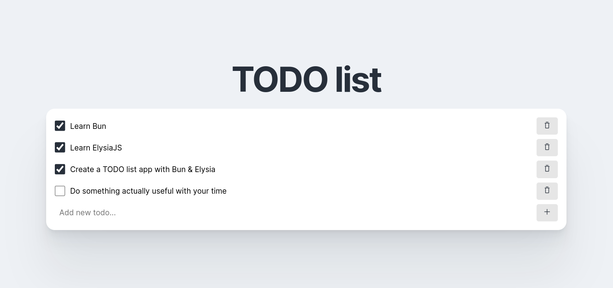

# Bun + Elysia + React test TODO app

This is a test TODO list app built with Bun, Elysia and React.



## Running the project

To start the development server run:

```bash
bun run dev
```

Open [localhost:3000](http://localhost:3000/) in your browser to see the frontend app. \
You can view & test all API routes at [localhost:3000/swagger](http://localhost:3000/swagger)
